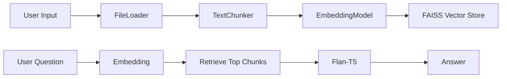

# 🤖 RAG Chatbot


---

## 🚀 Demo

🎥 *(Add demo GIF or video here)*
📸 *(Add screenshots of UI here)*

---

## 🧠 Overview

An AI-powered chatbot built using **Retrieval-Augmented Generation (RAG)** that answers questions from:

* 📂 PDF files
* 📄 TXT files
* 🌐 Web URLs

💡 Unlike traditional chatbots, this system retrieves relevant information before generating answers, ensuring **accuracy and context-awareness**.

---

## ⚙️ How It Works



---

## 🏗️ Project Structure

```id="x7q8m1"
rag_chatbot/
│── main.py
│── models/
│   ├── chunker.py
│   ├── embedding_model.py
│   ├── llm_model.py
│   ├── file_loader.py
│── vectorstore/
│   ├── faiss_store.py
│── requirements.txt
│── README.md
```

---

## 🔥 Features

* ✅ Upload PDF / TXT files
* ✅ Extract text from URLs
* ✅ Smart text chunking with overlap
* ✅ Semantic search using FAISS
* ✅ Context-aware answer generation
* ✅ Simple and interactive UI

---

## 🛠️ Installation

```bash
git clone https://github.com/your-username/rag_chatbot.git
cd rag_chatbot
```

### 🔧 Setup Environment

```bash
python -m venv venv
source venv/bin/activate  # Windows: venv\Scripts\activate
```

### 📦 Install Dependencies

```bash
pip install -r requirements.txt
```

---

## ▶️ Run the App

```bash
uvicorn main:app --reload
```

Open in browser:
👉 [http://127.0.0.1:8000](http://127.0.0.1:8000)

---

## 💬 How to Use

1. Upload a file or enter a URL
2. Wait for processing
3. Ask a question
4. Get a smart AI-generated answer

---

## 📊 Example

**Input Question:**

```text
What is the main topic of this document?
```

**Output:**

```text
The document discusses...
```

---

## 🧠 Tech Stack

* **Backend:** FastAPI
* **Embeddings:** Sentence-Transformers
* **Vector DB:** FAISS
* **LLM:** Flan-T5 (Hugging Face)
* **Parsing:** PyPDF2, BeautifulSoup
* **Math:** NumPy

---

## 🤝 Collaboration

Developed in collaboration with **Eng. Mostafa Saad**, focusing on:

* Model architecture
* Pipeline optimization
* Performance improvements

---

## 📈 Future Improvements

* 🔄 Chat memory
* 🌍 Multi-language support
* ⚡ Faster embedding with batching
* ☁️ Cloud deployment (AWS / GCP)
* 🎨 Better UI/UX

---

## ⭐ Why This Project Matters

> Traditional chatbots hallucinate.
> This chatbot retrieves → then generates.

💥 That’s the power of RAG.

---

## 👩‍💻 Author

**Aya Ali**
Junior Software & AI Engineer


نظبط إيه بعد كده؟ 🔥
